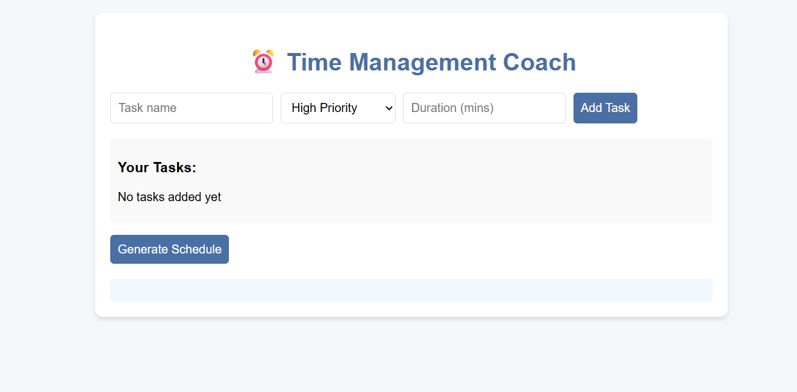

# ⏰ Time Management Coach

The Time Management Coach is a sophisticated web application designed to help you efficiently manage your tasks and generate an optimized daily schedule. It provides an intuitive interface to add tasks with varying priorities and durations, then leverages a powerful scheduling mechanism, enhanced by an external AI service, to organize them into a cohesive timeline.

---

## ✨ Features

* **Task Management**: Easily add new tasks, specifying a name, priority (High, Medium, Low), and estimated duration.
* **Priority-Based Scheduling**: Tasks are intelligently prioritized to ensure critical activities are placed effectively within your schedule.
* **Intelligent Scheduling (API-Driven)**: The application is designed to integrate with an external API service for advanced, AI-powered schedule optimization, aiming to provide the most efficient task arrangement.
* **Persistent Task Storage**: Your added tasks are securely stored locally in your browser's storage, ensuring your task list remains intact across sessions.
* **Dynamic Schedule Generation**: Instantly generates a structured schedule based on your current task list with a single click.
* **Productivity Insights**: Receive valuable productivity tips with each generated schedule to enhance your workflow.

---

## 🚀 How to Use

To maximize your productivity with the Time Management Coach:

1.  **Adding a Task**:
    * Locate the input fields at the top of the application.
    * Enter a concise **Task name** (e.g., "Prepare presentation for client meeting").
    * Select the appropriate **Priority** from the dropdown menu (High, Medium, or Low), reflecting the task's urgency and importance.
    * Input the estimated **Duration** in minutes (e.g., "90" for an hour and a half).
    * Click the **"Add Task"** button to append it to your task list.
2.  **Managing Your Tasks**:
    * Your added tasks will be displayed in a list below the input area.
    * To remove a task, simply click the **"×"** button positioned next to the task item.
3.  **Generating Your Schedule**:
    * Once all your tasks are entered and organized, click the prominent **"Generate Schedule"** button.
    * The application will then process your tasks and display a detailed, optimized schedule, indicating start and end times for each activity.

---

## 🤖 How the Scheduling API Works (Simulated)

The core intelligence behind the schedule generation is designed to interact with an external API. When you click "Generate Schedule":

1.  **Data Transmission**: The application gathers all your entered tasks, including their names, priorities, and durations.
2.  **API Request**: This task data is then sent as a request to a designated API endpoint (simulated in this demo). In a real-world scenario, this API would typically host an AI or optimization algorithm.
3.  **Intelligent Processing**: The external API (or its simulated counterpart) processes the task data, applying sophisticated algorithms to determine the most efficient order and time slots for each task, considering factors like priority and duration.
4.  **Schedule Reception**: The optimized schedule is then returned from the API to your browser.
5.  **Display**: The application takes the received schedule data and renders it clearly on your screen, providing your personalized daily plan.

**Note**: For this particular demonstration, the API interaction is simulated using an enhanced local algorithm that mimics AI behavior. In a production system, you'd replace this with actual API calls to a powerful AI backend (e.g., using Google's Gemini API, OpenAI's GPT, or a custom optimization service). The `API_KEY` in `script.js` is a placeholder and should be replaced with your actual, securely managed API key for live deployment.

---

## 💻 Technologies Used

* **HTML5**: Provides the foundational structure and content for the web application.
* **CSS3**: Styles the application, ensuring a clean, modern, and user-friendly interface.
* **JavaScript**: Powers all interactive elements, handles task management, manages local storage, and orchestrates the communication for schedule generation.

---

## 🚀 Deployment

This project is built as a static site, making it incredibly simple to deploy live on the web.

1.  **Prepare Your Files**: Ensure that your `index.html`, `style.css`, and `script.js` files are all located together in the same directory.
2.  **How to Deploy on Netlify (Quickest Method)**:
    * Navigate to the [Netlify website](https://www.netlify.com/) and log in (or sign up).
    * On your Netlify dashboard, look for an option to **"Add new site"** or **"Deploy manually."**
    * Simply **drag and drop your entire project folder** (the one containing your `index.html`, `style.css`, and `script.js` files) directly onto the designated upload area on the Netlify page.
    * Netlify will automatically detect your project, build (if necessary, though not for this static site), and deploy it within seconds, providing you with a live URL.
    * Alternatively, for continuous deployment, you can connect your project's **Git repository** (e.g., GitHub, GitLab, Bitbucket) to Netlify. This way, any changes you push to your repository will automatically trigger a new deployment of your site.

---
